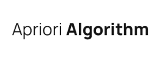

<!-- Intro-->

<!--
* Thanks for reviewing my Project-README-Template! 
* Access the blank-template here (https://github.com/YousefIbrahimismail/Project-README-Template/blob/main/Templates/_blank-README.md) 
* 
* Read the comments for an easy step by step guide.or read this Make_it_Yours guide here: () // add Personalization_md_file
* Enjoy!
-->


<!-- Shields Section--><!-- Optional -->

<!-- 
* Insert project shields and badges through this link https://shields.io/
* 
*
-->

<div align="center">
    <a href="https://github.com/AJSahagun/CS-422_K-Means_Clustering/stargazers"></a>
    <a href="https://github.com/AJSahagun/CS-422_K-Means_Clustering/issues"></a>
    <a href="https://github.com/AJSahagun/CS-422_K-Means_Clustering/network"></a>
</div>
<br>


<!-- Logo Section  --><!-- Required -->

<!--
* Insert an image URL in the  "src" attribute bellow. (line )
* 
* Insert your github profile URL in the <a> "href" attribute bellow (line )
-->


<div align="center">
    <a href="https://github.com/jabeehotdog/CS-422_Apriori-ML-4/" target="_blank">
        
    </a>
</div>


<!-- Project title 
* use a dynamic typing-SvG here https://readme-typing-svg.demolab.com/demo/
*
*  Instead you can type your project name after a # header
-->

<div align="center">

</div>


## About<!-- Required -->
<!-- 
* information about the project 
* 
* keep it short and sweet
-->


Apriori Algorithm is a foundational method in data mining used for discovering frequent itemsets and generating association rules. Its significance lies in its ability to identify relationships between items in large datasets which is particularly valuable in market basket analysis.


## How to use this project<!-- Required -->
<!-- 
* Here you may add information about how 
* 
* and why to use this project.
-->

- Clone this repository into your local machine.

```bash
    git clone https://github.com/jabeehotdog/CS-422_Apriori-ML-4.git
```

- Set up your environment
```bash
    pip install -r requirements.txt
```


Run the main script:
```bash
    python main.py
```


## Demo<!-- Required -->
<!-- 
* You can add a demo here GH supports images/ GIFs/videos 
* 
* It's recommended to use GIFs as they are more dynamic
-->

### Result
- 

- 

- 


## Table of Contents<!-- Optional -->
<!-- 
* This section is optional, yet having a contents table 
* helps keeping your README readable and more professional.
* 
* If you are not familiar with HTML, no worries we all been there :) 
* Review learning resources to create anchor links. 
-->


<dev display="inline-table" vertical-align="middle">
<table align="center" vertical-align="middle">
        <tr>
            <td><a href="#about">About</a></td>        
            <td><a href="#how-to-use-this-project">Getting started</a></td>
            <td><a href="#demo">Demo</a></td>
            <td><a href="#project-roadmap--">Project Roadmap</a></td>
        </tr>
        <tr>
            <td><a href="#documentation">Documentation</a></td>
            <td><a href="#contributors">Contributors</a></td>
            <td><a href="#acknowledgments">Acknowledgments</a></td>
            <td><a href="#contact">Contact</a></td>
        </tr>
</table>
</dev>


<!-- - Use this html element to create a back to top button. -->
<p align="right"><a href="#how-to-use-this-project">back to top ⬆️</a></p>


## Project Roadmap <!-- Optional --> <!-- add learning_Rs-->
<!-- 
* Add this section in case the project has different phases
* 
* Under production or will be updated.
-->

- [x] Create Project Repository
- [x] Choose a dataset
- [x] Start ML Model development
- [x] Evaluate the Model's accuracy
- [x] Implement visualization
- [x] Implement Revisions
- [x] Add visualization improvements


<p align="right"><a href="#how-to-use-this-project">back to top ⬆️</a></p>

## Documentation<!-- Optional -->
<!-- 
* You may add any documentation or Wikis here
* 
* 
-->
### Project Structure
```
CS-422_K-Means_Clustering/
│
├── data/
│   ├── kaggle_Interests_group.csv
│
├── img/
│   ├── confidence.png
│   ├── frequent itemsets.png
│   └──logo.png
├── src/
│   ├── custom_apriori.py
│   ├── preprocess.py
│   └── visualization.py
├── requirements.txt           # Project dependencies
├── README.md                  # Project documentation
└── main.py                  
```


## Contributors<!-- Required -->
<!-- 
* Without contribution we wouldn't have open source. 
* 
* Generate github contributors Image here https://contrib.rocks/preview?repo=angular%2Fangular-ja
-->

<a href="https://github.com/jabeehotdog/CS-422_Apriori-ML-4/graphs/contributors">
  
</a>


## Acknowledgments<!-- Optional -->
<!-- 
* Credit where it's do 
* 
* Feel free to share your inspiration sources, Stackoverflow questions, github repos, tools etc.
-->
### Group Members
#### Data Gathering
- AARON JOHN SAHAGUN
#### Model Development
- MICHAEL JOHN RHEY MASAGNAY
- JOHN PAUL MEDRANO
- ROSELER TANEDO JR
#### Documentation
- CARL JUSTIN ULARTE
- JOHN HAROLD PRIETO
- DESXZOR NAVARRO
- CAREN TOLENTINO
- RONALDO PESIGAN


<!-- - Use this html element to create a back to top button. -->
<p align="right"><a href="#how-to-use-this-project">back to top ⬆️</a></p>


## Feedback<!-- Required -->
<!-- 
* You can add contacts information like your email and social media account 
* 
* Also it's common to add some PR guidance.
-->


> You can make this project better, please  feel free to open a [Pull Request](https://github.com/AJSahagun/CS-422_K-Means_Clustering/pulls).
- If you notice a bug or a typo use the tag **"Correction"**.
- If you want to share any ideas to help make this project better, use the tag **"Enhancement"**.

<details>
    <summary>Contact Me 📨</summary>

### Contact<!-- Required -->
Reach me via email: [21-04332@g.batstate-u.edu.ph](mailto:21-04332@g.batstate-u.edu.ph)
<!-- 
* add your email and contact info here
* 
* 
-->
    
</details>


<!-- - Use this html element to create a back to top button. -->
<p align="right"><a href="#how-to-use-this-project">back to top ⬆️</a></p>